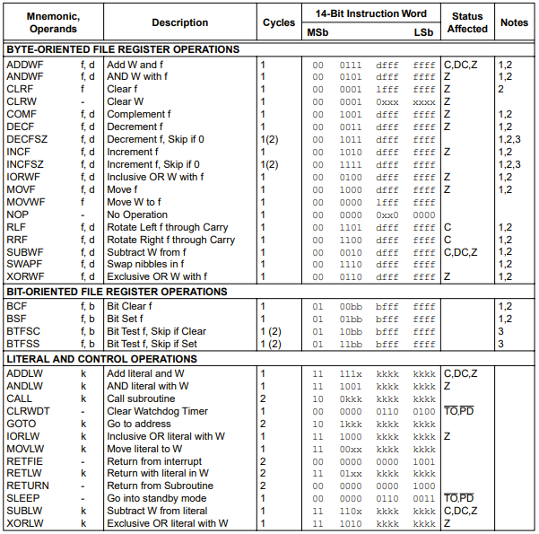
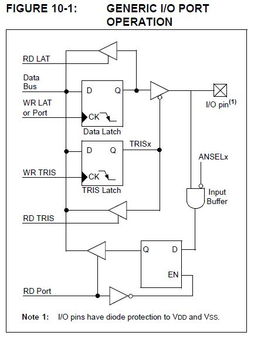
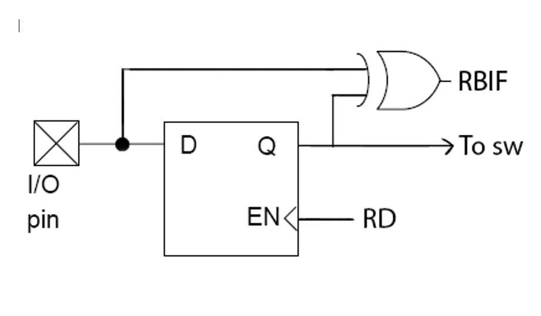
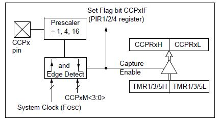
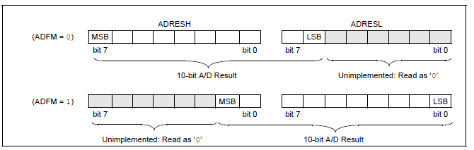

# Microcontrollori-notes

Appunti del corso di microcontrollori, Politecnico di Milano, 2020-2021.

Documento originariamente creato da [Squareroot7](https://github.com/Squareroot7/pic-notes)

Indice creato con [github-markdown-toc](https://github.com/ekalinin/github-markdown-toc)

Table of Contents

=================

* [pic-notes](#pic-notes)
  * [Numeri binari](#numeri-binari)
    * [Endianness](#endianness)
    * [Complementi](#complementi)
  * [ASSEMBLY](#assembly)
    * [Operazioni eseguibili dal PIC16](#operazioni-eseguibili-dal-pic16)
    * [Memoria e la suddivisione in banchi](#memoria-e-la-suddivisione-in-banchi)
    * [Registri importanti](#registri-importanti)
      * [Quali istruzioni affliggono lo STATUS register?](#quali-istruzioni-affliggono-lo-status-register)
      * [Il program counter (PC)](#il-program-counter-pc)
    * [Struttura del codice](#struttura-del-codice)
    * [Salti e return in assembly](#salti-e-return-in-assembly)
    * [Direttive asm](#direttive-asm)
      * [Differenze tra pseudo-istruzioni, macro, direttive](#differenze-tra-pseudo-istruzioni-macro-direttive)
    * [Scrivere programmi in pseudo codice](#scrivere-programmi-in-pseudo-codice)
    * [Cosa deve essere salvato durante una IRQ (Interrupt request routine)](#cosa-deve-essere-salvato-durante-una-irq-interrupt-request-routine)
    * [Stringa di configurazione della CPU](#stringa-di-configurazione-della-cpu)
    * [Codice di esempio con loop infinito](#codice-di-esempio-con-loop-infinito)
    * [Indirizzamento diretto e indiretto (come utilizzare FSR e INDF)](#indirizzamento-diretto-e-indiretto-come-utilizzare-fsr-e-indf)
    * [Codice d'esempio sull'utilizzo di un FOR con FSR/INDF](#codice-desempio-sullutilizzo-di-un-for-con-fsrindf)
    * [Velocità di esecuzione delle istruzioni](#velocità-di-esecuzione-delle-istruzioni)
  * [Esercitazione 1](#esercitazione-1)
    * [Perché vengono usati dei condensatori?](#perché-vengono-usati-dei-condensatori)
    * [Brown OUT](#brown-out)
    * [Latch UP](#latch-up)
    * [Oscillatori](#oscillatori)
    * [Selezione del banco di memoria](#selezione-del-banco-di-memoria)
    * [Interazione con le porte](#interazione-con-le-porte)
  * [Esercitazione 2](#esercitazione-2)
    * [Interazione con i registri](#interazione-con-i-registri)
  * [Esercitazione 3](#esercitazione-3)
  * [Esercitazione 4](#esercitazione-4)
  * [Esercitazione 5](#esercitazione-5)
    * [Indirizzamento indiretto](#indirizzamento-indiretto)
    * [TIMER2](#timer2)
    * [ADC](#adc)
  * [Lezione 1](#lezione-1)
    * [GPIO](#gpio)
      * [BISOGNA USARE PORT O LAT IN INPUT O OUTPUT?](#bisogna-usare-port-o-lat-in-input-o-output)
      * [EASYPIC BOARD SETUP](#easypic-board-setup)
  * [Lezione 2](#lezione-2)
    * [INTERRUPT](#interrupt)
  * [Lezione 3](#lezione-3)
    * [TIMER0](#timer0)
    * [TIMER1 modalità 16Bit vs 2x8](#timer1-modalità-16bit-vs-2x8)
      * [Modalità 2x8](#modalità-2x8)
      * [Modalità 1x16](#modalità-1x16)
  * [Lezione 4](#lezione-4)
    * [LCD](#lcd)
  * [Lezione 4 - CCP (Sonar)](#lezione-4---ccp-sonar)
    * [Cosa succede se TIMER1 va in overflow più volte durante una misura di CCP?](#cosa-succede-se-timer1-va-in-overflow-più-volte-durante-una-misura-di-ccp)
  * [Lezione 6 - ADC](#lezione-6---adc)
  * [Lezione 7 - PWM](#lezione-7---pwm)
  * [PIC 16](#pic-16)
  * [Appunti sulle conversioni sonar modalità capture e sonar letto con l'adc](#appunti-sulle-conversioni-sonar-modalità-capture-e-sonar-letto-con-ladc)
    * [SONAR in modalità CAPTURE](#sonar-in-modalità-capture)
    * [SONAR letto con ADC](#sonar-letto-con-adc)

## Numeri binari

### Endianness

La *Endianness* (ordine dei byte in Italiano) indica in che modo vengono salvati i bit all'interno della memoria di un sistema:

* **Big endian**: i bit più significativi (MSB) sono scritti **per primi**
* **Small endian**: i bit meno significativi (LSB) sono scritti **per primi**

### Complementi

Sono il metodo più diffuso per rappresentare numeri con segno in informatica. Il segno della somma di due numeri complementati verrà determinato in modo automatico, senza dover prendere particolari accorgimenti.

* **Complemento ad uno**: si invertono i bit della parola. **Problema:** ci sono due rappresentazioni per il numero 0 (+0 e -0)
* **Complemento a due**: si invertono i bit della parola e poi si somma 1. **La rappresentazione di 0** è univoca.

## ASSEMBLY  



istruzioni ASSEMBLY del PIC16

### Operazioni eseguibili dal PIC16

A causa della semplicità del microcontrollore, potranno solo essere effettuate operazioni:

* Algebriche:
  * Somma
  * Sottrazione
  * Shift left/right (quindi moltiplicazione/divisione di un valore per una potenza di due)
  * Incremento/decremento di 1
  * Complemento
* Logiche:
  * AND
  * OR
  * XOR
* Di salto:
  * Incondizionato
  * Condizionato
  * Ritorno da subroutine

Non sarà quindi possibile eseguire nativamente operazioni quali moltiplicazioni, sottrazioni, confronti. Bisognerà infatti costruire delle routine per poter effettuare questo tipo di operazioni.

### Memoria e la suddivisione in banchi

La memoria del microcontrollore è costituita da dei banchi di memoria in cui si trovano tutti i registri disponibili. Per una questione di indirizzamento, non viene utilizzata un'unica pagina di memoria piena di registri, ma si utilizzano 4 banchi separati.

Infatti, a causa della limitatezza nella dimensione della memoria (8 bit), non sarebbe possibile accedere a più di 2^8 (256) indirizzi memoria. Dividendo la memoria in banchi da 256 indirizzi e selezionando, all'occorrenza, il banco di memoria necessario tramite alterazione di un altro registro, è possibile lavorare con memorie più ampie (nel caso del PIC16, 1024 indirizzi).

Come si può vedere, questi banchi contengono dei registri ripetuti più volte. Infatti questi sono i registri più comuni, ed è molto comodo non cambiare banco ogni qual volta si vuole eseguire un'operazione con uno di questi.

### Registri importanti

Alcuni dei registri importanti in un PIC sono:

* `PROGRAM COUNTER`*(PC)* è il registro che tiene traccia dell'indirizzo dell'istruzione corrente. È a sua volta composto da due registri, `PCL` e `PCH` Normalmente incrementa di 1 ad ogni istruzione, ma può essere manipolato dalle istruzioni di branch.
  * `PCL` contiene i bit da 0 7. È mappato in memoria ed è accessibile in lettura o in scrittura
  * `PCH` contiene i bit da 8 a 12. Non è accessibile direttamente in lettura o scrittura e deve essere manipolato tramite un meccanismo che coinvolge il registro `PCLATH`
* `PCLATH` è il registro che fornisce i bit necessari all'istruzione di branch per effettuare il salto. I bit `<4:3>` vengono utilizzati nel `PCH` quando viene chiamata una istruzione `GOTO`.
* `W` *(working register)* registro usato come operando nelle operazioni della ALU, sia come sorgente che come destinazione. Può anche essere manipolato direttamente poiché è mappato nella RAM.
* `FSR` contiene l'indirizzo di memoria a cui punta il registro `INDF`. É mappato nella RAM.
* `INDF` è un registro virtuale che punta all'indirizzo contenuto in `FSR`. Può essere manipolato come un normale registro e viene usato per l'indirizzamento indiretto.
* `OPTION` contiene vari bit di controllo per configurare:
  * il *pull-up* della porta B (bit 7)
  * l'*edge* dell'interrupt sulla porta B (*rising* o *falling*, bit 6)
  * la sorgente del clock del TIMER 0 (transizione sul pin RA4/T0CKI o clock interno, bit 5)
  * l'*edge* dell'interrupt sul pin RA4/T0CKI B (*rising* o *falling*, bit 4)
  * il *prescaler* del TIMER 0 (bit 3)
  * il *postscaler* del WATCHDOG (bit 2-0)
* `STATUS` è il registro che può essere definito come il più importante del microcontrollore. Esso contiene i bit usati per:
  * l'indirizzamento indiretto (bit 7, `IRP`
  * l'indirizzamento diretto  (bit 6-5, `RP1:RP0`
  * segnalare il *TIME OUT* (bit 4)
  * segnalare il *POWER DOWN* (bit 3)
  * segnalare se l'ultima operazione eseguita dalla ALU (aritmetica o logica) ha risultato zero (bit 2, `Z`)
  * segnalare se c'è stato un carry **dal quarto bit in giù (quindi nel secondo nibble)** nell'ultima operazione eseguita dalla ALU (bit 1, `DC`)
  * segnalare se c'è stato un carry nell'ultima operazione eseguita dalla ALU  (bit 0, `C`)

#### Quali istruzioni affliggono lo STATUS register?

* Tutte le operazioni di *addizione* (`ADDWF`, `ADDLW`), *sottrazione* (`SUBWF`, `SUBLW`) affliggono i bit `C` (carry) `DC` (digit carry) `Z` (zero)
* Le *rotate left* e *rotate right* (`RLF`, `RRF`) affliggono il bit `C` (carry) perché hanno bisogno di 1 bit da salvare per lo shift

* Tutte le operazioni di *incremento* e *decremento* non condizionali affliggono il bit `Z`
* Le operazioni logiche `ANDWF`, `CLEARF`, `CLEARW`, `COMF`, `IORWF`, `MOVF`, `XORWF`, `ANDLW`, `IORLW`, `XORLW` affliggono il bit `Z`

* Tutte le operazioni rimanenti non affliggono lo `STATUS` (per esempio, lo swap dei nibbles)

#### Il program counter (PC)

Il program counter `PC` è un registro che tiene traccia dell'indirizzo di memoria dell'istruzione correntemente eseguita. Ha 13 bit di larghezza:

* I primi 8 (gli LSB) provengono dal registro `PCL`, leggibile e scrivibile
* Gli altri 3 (i MSB) provengono dal registro `PCLATH`.

Una istruzione `GOTO` avviene tramite somma di un offset al registro `PCL`.

Il `PC` è aggiunto alla stack (PUSH) tramite una call ad una subroutine o da un interrupt, mentre viene recuperato dalla stessa (POP) nell'eventualità che vengano chiamate le istruzioni `RETURN` (ritorno da subroutine), `RETLW` (ritorno da tabella), o `RETFIE` (ritorno da interrupt routine).

Il `PCLATH` non è coinvolto da queste operazioni e quindi non viene mai aggiunto alla stack.

### Struttura del codice

### Salti e return in assembly

* `GOTO XXX`: salto assoluto. Aggiorna il PC ad un'etichetta designata. La dimensione dell'indirizzo dell'etichetta è di 11 bit. È sensibile al paging, infatti il bit 12 e 13 vengono letti da `PCLATH`. Quindi sarà necessario usare la direttiva `BANKSEL` oppure modificare il registro `PCH`. Nei PIC18 il PC è a 21 bit assoluti e il `GOTO` è a 20bit; quindi può spostare l'esecuzione ovunque in 2M di memoria (in due cicli), ma c'è il problema del paging con `PCLATU` (non più H)
* `BRA XXX`: salto relativo. Ci si può spostare di massimo ±1023 posizioni dall'indirizzo di partenza. Essendo un salto condizionale partendo dal valore del PC corrente, non è affetto dal paging (non è disponibile nei PIC16).
* `RETFIE`: specifica il return dall'interrupt (quindi sposta quello che c'era nel Top Of Stack nel `PC`) e riattiva il general interrupt `GIE` (che è stato disattivato all'ingresso della routine dell'interrupt).
* `CALL`: va all'etichetta, esattamente come il goto, quindi è affetto da paging (sarà necessario quindi usare la direttiva `BANKSEL`). Salva nello stack il `PC` corrispondente alla posizione di chiamata. Appena la routine chiamata dal `CALL` termina, il `PC` viene riportato all'indirizzo chiamante.

### Direttive asm

* `#include`: stesso utilizzo del C++. Esempio: `#include <p18f452.inc>`
* `UDATA`: dichiara l'inizio di una sezione di dati non inizializzati. Per riservare lo spazio in questa sezione bisogna utilizzare la direttiva `res`. L'utilizzo è `LABEL res #byte`. Se non vengono specificate label e indirizzo, (es `VARIABLES_IN_BANK udata 0x20`) é sufficiente usare la direttiva `.udata` e il linker provvederà in modo autonomo.
* `BANKSEL XXX`: Serve per selezionare automaticamente il bank in base all'etichetta desiderata. Quindi se si vuole selezionare il registro *TRISB* senza sapere in che banco ci si trova, è sufficiente scrivere `BANKSEL TRISB`. Questo permette di poter riutilizzare *(con le dovute precauzioni della scelta del micro)* lo stesso codice su più micro diversi senza dovermi preoccupare del Bank da selezionare.
* `CODE XXXX`: (indirizzo opzionale) significa che il linker può piazzare il codice nella program memory all'indirizzo specifico XXXX segnalato dall'utente, oppure viene lasciata libera la scelta dell'indirizzo al linker se il parametro non viene specificato.
* `END`: specifica all'assembler che questa è la fine del file asm. Ogni file asm deve necessariamente finire con la direttiva `END`. Se così non fosse, l'assembler continuerebbe a cercare in tutta la memoria istruzioni da eseguire.
* `EQU`: analogo del define del C++. Esempio: `MYPORT equ PORTD` (etichetta eq nome_indirizzo_in_RAM).

#### Differenze tra pseudo-istruzioni, macro, direttive

* **Direttiva**: una direttiva assembly è un comando utilizzato a livello software che compare nel source code ma non è direttamente traducibile come opcode. Di conseguenza una direttiva non compare nell'instruction set del datasheet del PIC ma nella User's guide del MPASM™ Assembler.
* **Pseudo-istruzione**: istruzione asm scritta con parole diverse in modo tale da agevolare la memorizzazione. Per esempio, nel PIC16 , c'è `MOVWF`, mentre la sua “complementare” dovrebbe essere `MOVFW`. Nelle istruzioni del datasheet però esiste solo `MOVF, w`. L'assemblatore via software permette di tradurre direttamente `MOVF, w` tramite la pseudo-istruzione `MOVFW`, in modo tale da avere meno confusione nel codice e migliore memorizzazione.
* **Macro**: può essere considerata come “un'istruzione” a livello di sviluppo software, ma in realtà è **un gruppo di istruzioni unificate sotto un unico nome**. A differenza delle funzioni in linguaggio C, la macro è una sostituzione **in-line**. Questo significa che non viene effettuata una call, non viene cambiato il PC, non viene allocato spazio nello stack. Il contenuto della macro viene semplicemente inserito in quel punto del programma. Per maggiori informazioni, leggere la User's guide del MPASM™ Assembler.

### Scrivere programmi in pseudo codice

Un processo alla base della scrittura di algoritmi per i neofiti della programmazione è lo sviluppo iniziale in pseudo-codice.
Pur essendo all'apparenza *"troppo base e scontato"*, questo è un ottimo metodo sia per formalizzare l'algoritmo, sia in fase di debug per ricontrollare codice!
Facciamo immediatamente un esempio (tenendo a mente le istruzioni del PIC16):

Vogliamo comparare due variabili `B` e `A`, ponendo come condizione vera quando `B` è maggiore di `A`. In linguaggio C tutto ciò è intuitivo:
`if (B > A)`. Ma nelle istruzioni del PIC16 non c'è il confronto maggiore o minore, **possiamo usare solo addizioni, sottrazioni e operazioni logiche o bit a bit**.  
Di conseguenza andiamo a scrivere un po' di pseudo codice utilizzando solo queste operazioni:  

``` pseudocode
prendi risultato
carica B su risultato   
sottrai A a risultato   
...   
se risultato è negativo
->B è minore di A  
...  
se risultato è positivo  
->B è maggiore di A
```

Ora dobbiamo convertire tutto questo pseudo codice in qualcosa che il compilatore può capire.  
**In questo esempio troviamo due criticità**:  

1. è necessario avere un'ulteriore variabile risultato -> uso il working register `w`
2. devo controllare il segno di risultato -> il registro `STATUS` contiene il bit carry (che viene portato a 1 nel caso in cui un'operazione restituisca una variabile negativa)

Vado dunque a scrivere il codice:

``` asm
MOVFW B; sposto B nel working register
SUBFW A; sottraggo A al working register
BANKSEL STATUS; vado a selezionare il bank in cui sta STATUS
BTFSS STATUS, c; Se B-A<0  ALLORA salta la prossima istruzione
GOTO B_MAGGIORE; se il bit test non non salta allora B è maggiore
GOTO B_MINORE; se il bit test salta allora B è minore
```

### Cosa deve essere salvato durante una IRQ (Interrupt request routine)

Devono essere salvati:

* Registro *W*
* Registro *FSR*
* Registro *PCLATH*
* Registro *STATUS*

in un registro ad uso generico nel banco attualmente selezionato.

Esempio di codice:

``` asm
MOVWF W_TEMP; Copia il contenuto di W nel registro TEMP, nel banco 1 o 0
SWAPF STATUS, W; Salva il registro status in W
CLRF STATUS; indipendentemente dalla pagina, cancella IRP, RP1, RP0 nel banco 0
MOVWF STATUS_TEMP; Salva il registro status nel registro STATUS TEMP nel banco 0

MOVF PCLATH, W; Necessario nel caso si usi il banco 1, 2 o 3
MOVWF PCLATH_TEMP; Salva PCLATH in W
CLRF PCLATH; Pagina zero, indipendentemente dalla pagina attuale

BCF STATUS, IRP; Ritorna al banco 0
MOVF FSR, W; Copia FSR in W
MOVWF FSR_TEMP; Copia FSR da W a FSR_TEMP

: ; abbiamo salvato tutto quanto
: ; qua viene scritta la ISR
: ; dopo la routine di interrupt andiamo a ricaricare i salvataggi

MOVF PCLATH_TEMP, W; Recupera PCLATH
MOVWF PCLATH; Muove W in PCLATH
SWAPF STATUS_TEMP, W; Scambia il registro STATUS_TEMP con W
; (resetta il banco allo stato originario)

MOVWF STATUS; Sposta W nel registro STATUS

SWAPF W_TEMP, F; Inverte W_TEMP con F
SWAPF W_TEMP, W; Inverte W_TEMP con W
```

### Stringa di configurazione della CPU  

* `_CONFIG`: parola inizio configurazione  
* `_FOSC_XT`: selezione oscillatore (XT: cristallo)
* `_WDTE_OFF`: watch dog (inattivo)
* `_PWRTE_ON`: delay per alimentazione stabile uC all'accensione (acceso)  
* `_CP_OFF`: code protection (inattivo)  
* `_BOREN_ON`: brown out detect (attivo), se la tensione scende sotto una soglia (es alimentazione da batteria che si scarica) per evitare processi errati all'interno del microcontrollore, il `brown out resetta e tiene resettato il uC continuamente`

### Codice di esempio con loop infinito  

Questo codice contiene l'inizio del file asm che deve essere sempre inserito:

``` asm
_CONFIG _FOSC_XT & _PWRTE_ON & _CP_OFF & _BOREN_ON
GENERATOR
RES_VECT CODE 0x0000; processor reset vector
GOTO START; go to beginning of program

; TODO ADD INTERRUPTS HERE IF USED

MAIN_PROG CODE; let linker place main program
START
GOTO $ ; loop forever
END
```

### Indirizzamento diretto e indiretto (come utilizzare FSR e INDF)

1. **Diretto**: **l'indirizzo della RAM è direttamente contenuto nell'opcode**, quindi l'indirizzo viene dall'instruction register (che contiene l'opcode appena ricavato dal PC).

2. **Indiretto**: **l'indirizzo della RAM è già contenuto nel FSR** (File Select Register), di conseguenza l'opcode non deve contenere direttamente l'indirizzo nell'ISR ma il suo “indice” (come un puntatore). **Può essere utilizzato per non dover riscrivere più volte lo stesso codice per indirizzi diversi.** Ad esempio, al posto di `clear indirizzo1; clear indirizzo2; clear indirizzo3;`. basta incrementare il `FSR` e ripetere la stessa routine il numero necessario di volte.
   * Poiché solo i primi 8 bit (gli LSB) sono indirizzati dal `FSR`, per indirizzare locazioni di memoria successive bisogna fare uso del bit `IRP` del registro `STATUS`.
   * Il bit `IRP`, unitamente al bit 8 del `FSR` funzioneranno quindi da bank selector (come `RP1` ed `RP0`).
   * Con `IRP = 0` si selezioneranno i banchi 0 ed 1, con `IRP = 1` si selezioneranno i banchi 2 e 3.

### Codice d'esempio sull'utilizzo di un FOR con FSR/INDF

``` asm
CLRF 20h; cancella i dati all'indirizzo 20h
CLRF 21h; cancella i dati all'indirizzo 21h
:
:
CLRF 30h; cancella i dati all'indirizzo 30h
```

Come è possibile ottimizzare questa lunga sezione di codice? Tramite l'utilizzo dei registri `FSR` e `INDF`:

``` asm
MOVLW 0x20; Carico l'indirizzo di partenza in W
MOVWF FSR; lo sposto nel FSR
NEXT
EXT CLRF INDF; pulisco il registro puntato utilizzando INDF 
INCF FSR, f; incremento FSR
BTFSS FSR, 5; il bit 5 è a 1? Allora sono passato a 3xh (in cui la x sta per una cifra qualsiasi) quindi nel nostro caso 30h
GOTO NEXT; se non siamo ancora a 30h continua il loop - nota che questa istruzione non viene eseguita se la precedente istruzione è vera
```

### Velocità di esecuzione delle istruzioni

A causa dell'architettura del microcontrollore, una esecuzione richiede 8 colpi di clock per essere eseguita dall'inizio alla fine. Infatti, ognuna di essere sarà scomposta nella fase di *fetch* e in quella di *execute*, ciascuna richiedente 4 colpi di clock per essere completata.

Grazie alla struttura a pipeline, tuttavia, ogni 4 colpi di clock verrà eseguita una istruzione (tranne per le operazioni di salto che ne richiederanno 8). In contemporanea verranno eseguite la fase di *execute* di una funzione con la fase di *fetch* della successiva.

Poiché le istruzioni di branch possono dare origine a dei *data faults* (ovvero possono richiedere alla cpu delle informazioni che non sono ancora state processate dalla fase di *execute*), viene forzata una istruzione `NOP` in seguito alle stesse, obbligando un *flush* della memoria.

## Esercitazione 1

### Perché vengono usati dei condensatori?

In un circuito ideale, le connessioni tra componenti avvengono tramite cavi che non presentano alcuna opposizione al passaggio di corrente. Nella realtà, tutta via, ciò è ovviamente falso.

Infatti, in ogni collegamento si vengono a creare degli effetti *induttivi* causati da componenti parassiti che risiedono all'interno degli stessi dispositivi. Per cercare in qualche modo di limitare questi disturbi nefasti si impiegano dei condensatori.

Essi infatti smussano la curva della tensione, soprattutto durante le commutazioni. Ricordando infatti che, per un induttore, maggiore è la variazione di tensione ai suoi capi, maggiore sarà la corrente da lui iniettata nel circuito.

Introdurre un condensatore in parallelo al microcontrollore ridurrà anche il *ripple* al suo ingresso.

### Brown OUT

Causato da un *glitch* nell'alimentazione, normalmente di breve durata, che temporaneamente oscilla attorno al suo valore di riferimento fino al di sotto della tensione di alimentazione del microcontrollore. Questo meccanismo può dare origine a malfunzionamenti nel software (reset del microcontrollore, modifica del contenuto della memoria).

Si innesca quindi il processo di **Brown out reset (BOR)**, i seguenti effetti:

* Viene attivato il timer `PWRT` (power up timer)
* Il programma sul PIC viene resettato, ricominciando dall'indirizzo puntato dal *reset vector*
* Viene sospesa la funzione `SLEEP` per tutta la durata del *BOR*
* Viene inizializzato il registro speciale `SFR` (special function register)

### Latch UP

Situazione che si verifica quando abbastanza corrente scorre attraverso il bulk di un transistor *cMOS*, causando una caduta di tensione sufficiente da attivare uno dei *BJT* parassiti che si vanno a creare a cavallo delle zone *n+* e *p+*. È anche causata, seppur più raramente, da scariche elettrostatiche (ESD) o da radiazione ionizzante.

### Oscillatori

Tipi di oscillatori esterni:

* `LP` - low power
* `XT` - crystal resonator - necessita di due condensatori collegati in parallelo
* `HS` - high speed crystal resonator
* `RC` - resistor capacitor - sfrutta un circuito *RC* passivo collegato al pin `OSC1`

Vengono collegati tra i pin *OSC1* ed *OSC2* del microcontrollore.

### Selezione del banco di memoria

Per accedere ad uno dei quattro banchi di memoria del microcontrollore, bisogna agire sui bit 6 e 7 (`RP0` e `RP1`) del registro `STATUS`.

### Interazione con le porte

Per predisporre lo stato della porta (*INPUT* o *OUTPUT*), bisogna prima agire sul registro `TRISx` con le istruzioni apposite (rispettivamente `BSF` e `BCF`) il relativo pin. Impostando ad 1 il valore del bit la porta funzionerà in input, mentre impostandolo a 0 la porta funzionerà in output. *Regola mnemonica:* 1 **I**nput, 0 **O**utput.

Successivamente si agisce sull'uscita effettiva della porta, sempre usando le due istruzioni (`BSF` e `BCF`), sul registro `PORTx` sul pin coinvolto nell'istruzione.

**Prima di tutto ciò bisogna verificare di essere sul banco di memoria corretto.**

Esempio:

``` asm
BCF TRISB,0 ; setta il pin 0 della porta B come output
BSF PORTB,0 ; porta ad 1 (HIGH) il l'uscita sul pin
```

## Esercitazione 2

### Interazione con i registri

*Nota* con `f` e `d` si indicano due registri generici (quelli indicati come *general purpose*)

Operazioni con i registri:

* Per caricare un valore nel registro `W` (il *working register*) si usa l'istruzione `MOVLW k` (il valore k verrà messo nel registro `W`).
* Per spostare un valore dal registro `W` ad un qualsiasi altro registro, si usa l'istruzione `MOVWF f` (il valore contenuto nel registro W verrà spostato all'interno del registro f).
* Per cancellare il contenuto del registro `f`, si usa l'istruzione `CLRF f`

Istruzioni usate:

* `MOVF f,d` copia il contenuto del registro f nel registro d. Questa istruzione influenza il bit `Z` del registro `STATUS`. Difatti, se il risultato è zero, il bit verrà settato ad 1 (e viceversa).
* `SWAPF f,d` inverte i due nibble di d e li salva in f.
* `ANDWF f,d` effettua l'operazione di and bit a bit tra il registro W ed il registro f e salva il risultato nel registro d. Se questo risultato è zero, il bit `Z` del registro `STATUS` viene portato ad 1.
* `ADDWF f,d` somma il contenuto di f al contenuto di w e salva il risultato in d. Ciò influenzerà i bit `Z`, `DC`, `C` del registro `STATUS`.
* `DECFSZ f,d` decrementa f e salta l'istruzione successiva se f diventa uguale a 0. d conterrà il valore f-1.

## Esercitazione 3

La direttiva `BANKSEL label` permette di selezionare il banco di memoria in cui l'etichetta *label* è definita. Non è possibile eseguire operazioni su *label* e deve essere stata definita in precedenza.

Per attivare l'interrupt bisogna prima abilitare la `IRQ` sulla porta desiderata settando i bit `RxIE` e `GIE` (che influenzano la `IRQ` rispettivamente sulla porta X e in modo generale) presenti nel registro `INTCON` della memoria.

Esempio:

``` asm
BSF INTCON,RBIE ; attiva la IRQ sulla porta B
BSF INTCON,GIR ; attiva la IRQ su tutto il dispositivo 

```

All'interno dell'interrupt routine bisognerà disattivare la `IRQ` su tutto il microcontrollore in modo da evitare l'interruzione della stessa a seguito di un altro interrupt. Inoltre, bisogna sempre leggere il valore sulla porta che ha scatenato l'interrupt in modo da poterla disabilitare e resettare il bit `RBIF`.
Infine, per ritornare alla routine principale si usa l'istruzione `RETFIE`.

Per abilitare i pull-up interni (nelle porte supportate) bisogna abbassare il pin 7 del registro `OPTION_REG` nel banco 1.

## Esercitazione 4

Durante la routine di interrupt bisogna salvare tutti quei registri che potrebbero venire modificati all'interno della stessa. In generale, possono essere i registri:

* `W`, working register
* `STATUS`, il registro di stato
* `FSR`, il registro di indirizzamento indiretto

**Nota: disattivare sempre la `IRQ` all'inzio della routine e di riattivarla alla fine**

## Esercitazione 5

### Indirizzamento indiretto

Il registro `PCL` contiene gli LSB del *program counter* (da 7 a 0). Gli MSB sono contenuti nel registro `PCLATH` (bit da 12 a 8) -> 2 bit (MSB) provengono dal registro `STATUS` e 7 bit (LSB) dall'istruzione. È possibile indirizzare 512 indirizzi.

### TIMER2

I registri coinvolti per usare il `TIMER2` in modalità PWM sono:

1. `CCP1CON`: bit da 5 a 4 gli MSB del PWM, bit da 3 a 0 la modalità di funzionamento (es, capture falling edge, capture rising edge, compare set on match...)
1. `TRISC2`: per selezionare lo stato del pin (ingresso, uscita...)
1. `PR2`: per impostare il valore massimo del timer
1. `T2CON`: bit da 6 a 3 per impostare il prescaler, bit 2 per abilitare la periferica, bit da 1 a 0 per impostare il postscaler

### ADC

I registri coinvolti sono:

1. `ADCON0`, `ADCON1`: impostano il comportamento analogico del PIN, abilitando l'ADC
1. `ADRES`: per impostare la risoluzione dell'ADC

## Lezione 1

### GPIO



**Nota** Tutti i pin sono impostati in **Input di default**. Quando si setta un digital out scrivere sempre LATx=0 per reset.

| Uso         | TRIS          | ANSEL          |
|:------------|:--------------|:---------------|
| Digital Out | TRISx.pin = 0 | don't care     |
| Digital In  | TRISx.pin = 1 | ANSELx.pin = 0 |
| Analog In   | TRISx.pin = 1 | ANSELx.pin = 1 |

**Nota** se dei pin **non vengono definitivamente utilizzati** nel progetto, vengono impostati come Output e poi il **LAT viene impostato a 0**. Questo previene switch (dovuti a cariche parassite accumulate) della porta che comportano consumo dovuto alla potenza dinamica di switching dell'ingresso.  

Ogni port ha diversi registri:

| Registro | 0 =                       | 1 =                        | Al reset               |
|:---------|:--------------------------|:---------------------------|:-----------------------|
| TRISx    | 0 = Output                | 1 = Input                  | Input                  |
| PORTx    | 0 = Reading low           | 1 = Reading high           | Undefined              |
| LATx     | 0 = Writing low           | 1 = Writing high           | Undefined              |
| ANSELx   | 0 = Digital buffer **ON** | 1 = Digital buffer **OFF** | Digital buffer **OFF** |

Significato dei registri:

* `TRIS` indica la direzione (input o output) del pin
* `PORT` buffer di lettura e scrittura
* `LAT` buffer di scrittura
* `ANSEL` indica il comportamento analogico del pin

#### BISOGNA USARE PORT O LAT IN INPUT O OUTPUT?

* **OUTPUT**: `LATx` e `PORTx` effettuano la stessa identica operazione di scrittura
* **INPUT**: `PORTx` rappresenta lo stato fisico del pin, mentre `LATx` rappresenta il registro che pilota il data latch.  

`Dove possono sorgere dei problemi?` Prendendo, per esempio `RB1` come digital output, è possibile svolgere tutte le operazioni di I/O con `PORTB.RB1` oppure `LATB.RB1` (non fa differenza).  
Cambiando `RB1` da digital output a digital input, suppongo che `LATB.RB1=1` come stato finale. Un bottone esterno impone ora il pin fisico con stato a 0. Usando `PORTB.RB1`, si legge che effettivamente il pin è a zero. Consultando invece `LATB.RB1` risulta che il pin è a 1. Di conseguenza quale registro bisogna usare?

* **INPUT usare sempre e solo** `PORT` in **READ**  
* **OUTPUT** usare ``PORT`` e `LAT` in **WRITE**, è indifferente

#### EASYPIC BOARD SETUP

* `PORTA`: usata per aggiungere pulsanti e per fare polling. `RA7`-`RA7` Connessi all'oscillatore.
* `PORTB`: quasi interamente dedicata al LCD. `IOCB` disponibile da RB7-RB4, LCD connesso da `RB5`-`RB0`. **NOTA**: `RB6` e `RB7` vanno fuori uso con il debugger ON.
* `PORTC`: poco spesso usata per altri scopi se non per il modulo sonar.
* `PORTD`: spesso usata per operazioni con i led (tutta la porta). `RD1` ha la funzione PWM.
* `PORTE`: usata per un PWM, PWM software o per dei led di segnalazione. `RE2`  ha la funzione PWM, `RE3` MCRL (reset esterno).

## Lezione 2

### INTERRUPT

Gli interrupt sono degli strumenti estremamente efficienti per gestire eventi asincroni interni o esterni senza dover alterare la normale esecuzione del programma.

Esempi di eventi asincroni:

* **Interni**: fine conversione ADC, overflow del TIMER ...
* **Esterni**: cambi di stato di un pin, ricezione di dati via spi ...

Tramite gli interrupt è possibile assegnare priorità differenti a ciascun processo che può avvenire simultaneamente, in modo da gestire temporalmente le varie funzioni.

Esistono due priorità di interrupt:

* A **bassa priorità** (LP)
* Ad **alta priorità** (HP)

L'interrupt è gestito salvando lo stato attuale e recuperando l'indirizzo a cui punta la routine di interrupt. L'esecuzione del programma principale può essere interrotta sia da interrupt **HP** ed **LP**, mentre le routine di interrupt possono essere interrotte solo da interrupt di priorità più alta.

Ci sono 2 registri da usare per gestire l'interrupt:

1. `IE` (interrupt enable), serve ad attivare globalmente l'interrupt. Se è riferita all'intero sistema e non ad un singolo componente, si chiama anche `GIE` (global interrupt enable)
1. `IF` (interrupt flag), serve a capire quale entità ha scatenato l'interrupt

Dopodiché è necessario definire una `ISR` (interrupt service routine), cioè la funzione che verrà chiamata quando l'interrupt viene causato. Essa deve essere quanto più leggera e veloce possibile, poiché una ISR di durata considerevole può creare problemi alla corretta esecuzione del programma principale.

L'intero processo di interrupt può essere quindi diviso in due fasi:

1. **Inizializzazione**

   1. Si attiva la periferica che causerà l'interrupt
   1. Si reimposta la `IF`
   1. Si abilita la `GIE`

1. **ISR**

   1. Si controlla la `IF` per capire che periferica ha scatenato l'interrupt
   1. Si resetta la relativa `IF`
   1. Si scrive il codice che deve essere eseguito

Registri relativi all'interrupt:

* `INTCON`, `INTCON2`, `INTCON3` interrupt control register
* `PIR1`, `PIR2`, `PIR3`, `PIR4`, `PIR5` peripheral interrupt registers
* `PIE1`, `PIE2`, `PIE3`, `PIE4`, `PIE5` peripheral interrupt enable registers
* `IPR1`, `IPR2`, `IPR3`, `IPR4`, `IPR5` interrupt priority registers
* `RCON` reset control register
* `IOCB` interrupt on change port B register

**NOTA** controllare sempre prima il datasheet per sapere con esattezza quali registri manipolare. Quattro dei pin della porta b (dal 7 al 4) sono configurabili come interrupt-on-change tramite I bit del IOCB. Per poter disattivare il bit **RBIF** è necessario prima leggere il valore sulla porta.

## Lezione 3

### TIMER0


Il TIMER0 è un contatore che subisce un overflow (passaggio da valore massimo a zero) dopo un tempo definito dall'utente attraverso il setup dei registri dedicati.
Si parte dalla selezione dell'oscillatore esterno o interno. Mediante un multiplexer possiamo selezionare la frequenza di incremento del contatore. **la sua frequenza tipica è Fosc/4 in cui, grazie al PLL, Fosc è 32MHz (8MHz di default)**.

**T0CKI** pin *(durante il corso non lo useremo mai)* è il pin per comunicare con l'esterno che se abilitato come sorgente fornisce un impulso edge sensitive in base alla impostazione selezionata con **T0SE** (incremento sul rising/falling edge).

Successivamente alla selezione della sorgente c'è la scelta dell'abilitazione del prescaler, **divisore di frequenza**. Il modo più facile per costruire un prescaler è utilizzare un contatore. Quest'ultimo quando supera una certa soglia fornisce in uscita un impulso. Può essere settato solo a potenze di 2 da 4 a 256 (massimo prescaler -> massimo tempo -> minima frequenza).

L'ultima sezione, tralasciando il sync clock, indica semplicemente che devono passare due colpi di clock per aggiornare il timer. Ci ritroviamo infine con il registro **TMR0L (registro low del timer 0)**. È un registro a 8 bit, i meno significativi del nostro registro di timer. **Questo registro è un contatore che setta la flag dell'interrupt TMR0IF quando va in overflow**. Se disabilito l'interrupt posso usarlo anche solo come contatore. **Il registro principale per configurare è T0CON**.

Attraverso gli overflow del TIMER0, quindi attraverso la routine di interrupt legata al flag del timer, possiamo gestire periodicamente delle sottosezioni di codice.  

La **frequenza di interrupt è frequenza d'ingresso (Fosc/4) diviso il prescaler che va da 1 (prescaler non attivo) a 256** .  

La configurazione con cui usiamo la nostra scheda è 32MHz. La frequenza di interrupt minima (che corrisponde al massimo tempo tra un interrupt e l'altro), è:  

```f_min = f_osc / ( 4  *256* ( 256 - TMR0L ))```

Bisogna tenere conto del **valore di TMR0L** (il valore iniziale contenuto nel registro). Settando **TMR0L=0** siamo sicuri che il contatore parta a contare sempre da zero.  
**Se vogliamo una frequenza di interrupt diversa da una potenza di 2** (vedi formula sopra), all'interno della routine di interrupt possiamo impostare TMR0L ad un valore diverso da zero.

Il **tempo di interrupt** si ottiene semplicemente invertendo la formula:  

```t_max = ( 4 * 256 * ( 256 - TMR0L ) ) / f_osc```

**4/32MHz = 1/8MHz corrispondono a 125 ns. Questo è fisso (a meno di disabilitare il PLL)**. Il risultato finale del tempo massimo dà 8.192 ms *(all'esame, 8ms è una approssimazione più che sufficiente)*. Se si volesse avere più precisione ci sono 2 opzioni:

* Salvare il valore del tempo di interrupt utilizzando un `long int` e tenendo, per esempio, in conto che ogni interrupt avviene ogni 8192ms:
  1. Scegliere il prescaler
  1. Modulare TMR0L in modo che dia un numero intero, sempre con l'aiuto del prescaler. Per esempio, **se TMR0L=6 allora il tempo è precisamente 8 millisecondi**. Questa impostazione deve essere inserita sempre all'interno della routine di interrupt e nelle prime righe di setup del codice così da avere:
     1. il valore iniziale impostato correttamente all'accensione del micro
     1. ogni volta che il timer va in overflow resettiamo la conta al valore iniziale voluto

### TIMER1 modalità 16Bit vs 2x8

**Nota** Solo i timer di indice pari possono funzionare a 16bit (**TIMER2**, **TIMER4**).  

Osservando il datasheet si nota che all'interno del registro TxCON è presente un bit (*TxRD16) che fa riferimento a **modalità 16bit o 2x8**.  

È certamente possibile utilizzare i timer di indice dispari a 8 bit, ma è necessaria una delle seguenti operazioni:

1. Usare solo gli 8 bit più significativi del registro in modo tale da poter comunque sfruttare l'overflow una volta pieno il timer. *(Il registro è da 16 bit)*
1. Sfruttare la **modalità 2x8**  

#### Modalità 2x8

Questa è la modalità più semplice per usare il timer. **TMRx** (registro da 16 bit) è semplicemente diviso in **TMrxH** e **TMRxL** (registri da 8 bit). La lettura viene fatta un bit alla vota e il flag di interrupt viene alzato all'overflow di **TMRxH**  

Questa modalità però **presenta dei problemi sostanziali**, che potrebbero portare a errori nel programma.

Facciamo un esempio:

1. Immaginiamo, con **TMR1** acceso, `TMR1H=0x00`,  `TMR1L=0xFF`
1. Procediamo con la lettura di **TMR1L** e salviamo il dato in una variabile.  Il risultato sarà pari a `0x00FF` (a 16 bit)
1. A questo punto leggiamo il byte alto **TMR1H**, ma il timer non è stato spento ed è andato avanti nel conteggio. Quindi `TMR1L=0x00`,  `TMR1H=0x01`
1. Il programma procede a leggere il Byte successivo e il risultato sarà pari a ` 0x00FF + 0x0100 = 0x01FF `, *valore diverso da quello atteso*, `0x00FF`

**Facciamo un esempio di lettura nell' altro senso:**`

1. Supponiamo, sempre con **TMR1** acceso, che `TMR1=0x00FF`
1. Il valore in **TMR1H** sarà `TMR1H=0x0000`
1. Il timer continuerà a contare, e quindi `TMR1=0x0100`
1. In **TMR1L** ci sarà un valore `0x0000; =/= 0x00FF` che ci aspettavamo.

Sostanzialmente si verifica sempre una discrepanza tra il valore atteso all'interno del timer e la somma dei valori letti nei due registri a cause del tempo necessario a raccogliere i valori contenuti in questi ultimi.

**Quando allora questa modalità è comoda da usare?**

* Quando non interessa il contenuto del timer ma solo l'overflow
* Quando interessa un solo byte del timer, sia esso H o L (utile, ad esempio, in un **PWM software**. Vedi gli appunti più avanti)

Per correggere questo problema è stato introdotta l'altra modalità, chiamata **1x16**.

#### Modalità 1x16

La modalità che chiameremo **1x16** viene chiamata ufficialmente **16Bit** Read/Write e quello che fa di fatto è **introdurre un buffer su TMR1H**
Il byte alto del timer a questo punto **non sarà più direttamente controllabile o leggibile** (lo chiameremo **TMR1H:**), ma si potrà accedere solamente al buffer (di fatto il PIC sposta fisicamente l'indirizzo, quindi a livello di codice si accederà allo stesso registro).
**Il buffer viene copiato** quando viene manipolato **TMR1L**:

* Lettura di **TMR1L**
  * Contemporaneamente **TMR1H:** verrà copiato in **TMR1H**
  * Così facendo la lettura del byte alto **TMR1H** sarà congruo allo stato del timer nel momento della lettura di **TMR1L** e non soffrirà del ritardo dovuto al tempo passato tra le istruzioni
* Scrittura di  **TMR1L**
  * Contemporaneamente **TMR1H** verrà copiato in **TMR1H:**
  * Così facendo il valore del byte alto **TMR1H** sarà congruo allo stato del timer nel momento della scrittura di **TMR1L** e non soffrirà del ritardo dovuto al tempo passato tra le istruzioni

**Problemi relativi a questa modalità:**

1. Se serve leggere solo a **TMR1H** si deve per forza leggere **TMR1L**, perdendo di fatto tempo.
1. Bisogna rispettare sempre l'ordine di lettura o scrittura (prima **TMR1L** e poi **TMR1H**). Invertendo le due operazioni si otterrebbero valori non validi e quindi potenzialmente un malfunzionamento del software.

## Lezione 4

### LCD

**Lo schermo LCD è composto da 2 righe e 16 colonne**.  

È importante capire che per comunicare con questo display esiste un protocollo apposito, altrimenti sarebbe necessario comunicare direttamente con la memoria interna dell'LCD. Per aggirare questa difficoltà è stata creata una libreria che è ad un “livello di astrazione più alto” rispetto alla manipolazione diretta dell'LCD.

Per comandare la memoria del dispositivo LCD bisogna **rispettare tempi precisi**, quindi nella libreria ci dovrà essere un sistema che genera queste temporizzazioni e per il programmatore finale non é importante sapere come. Quando andiamo a scrivere sull'LCD una stringa questa funzione della libreria impiega tempo (circa 1000 cicli macchina): **scrivere sull'LCD non sarà quindi una operazione immediata come una somma**.  

**Come fanno a generarsi dei ritardi fissi?** Con una funzione come il `delay_ms()`. Attenzione che usare `delay_ms()` vuol dire sapere con sicurezza la frequenza di clock del microcontrollore. Per questo dovremmo impostare in un altro modo l'LCD se volessimo gestirlo ad una frequenza diversa dalla 32MHz (alla quale lo gestiamo noi). **Se imposti a 32 MHz la frequenza e non abiliti il PLL infatti, l'IDE fa i calcoli precisi con la frequenza che gli è stata impostata**.  

Attenzione anche allo switch pin 6 (dallo schema e che dovrebbe essere già settato hardware giusto). Il display LCD è collegato alla porta B, sui primi 6 pin della porta B per la precisione, dalla 0 alla 5.  

**Rimangono liberi RB6 e RB7**. Se abbiamo il display collegato da `RB0` a `RB5` non possono essere usati per altro se non per l'LCD. L'`IOCB` (*Interrupt On Change port B*) funziona da `RB7` al `RB4`. Ma se abbiamo intenzione di usare come In Circuit Debugger, **quindi se vogliamo usare il debugger per capire cosa non va nel nostro programma, anche RB6 e RB7 risulteranno fuori uso**. Per questo motivo l'IOCB non lo useremo più dai prossimi laboratori, ma ci concentreremo sulle altre porte, precisamente sul quando ci sarà una transazione di stato su qualunque pin.  

C'è una parte di codice fissa da impostare se vuoi accendere l'LCD:

``` C
// Lcd module connections
sbit LCD_RS at LATB4_bit;
sbit LCD_EN at LATB5_bit;
sbit LCD_D4 at LATB0_bit;
sbit LCD_D5 at LATB1_bit;
sbit LCD_D6 at LATB2_bit;
sbit LCD_D7 at LATB3_bit;

sbit LCD_RS_Direction at TRISB4_bit;
sbit LCD_EN_Direction at TRISB5_bit;
sbit LCD_D4_Direction at TRISB0_bit;
sbit LCD_D5_Direction at TRISB1_bit;
sbit LCD_D6_Direction at TRISB2_bit;
sbit LCD_D7_Direction at TRISB3_bit;
// End Lcd module connections

void main(){
  Lcd_init();
  Lcd_Cmd(_LCD_CLEAR);
  Lcd_Cmd(_LCD_CURSOR_OFF);
  //
  //main code and while(1);
  //
}
```

**NOTA**: ricordare di attivare la libreria LCD e la parte di conversione delle char nell sezione delle librerie nell'IDE MikroC.

In particolare il comando principale è ``Lcd_Out(riga, colonna, “cosa vuoi scrivere”)``. Attenzione che **le stringhe in C sono un semplice array di char**, quindi una volta dichiarata la dimensione, essa non è modificabile in runtime e che **l'indice di riga e di colonna partono da 1 e non da 0**.

Quindi è importante ragionare sulla dimensione di questo array, che risulta essere un puntatore alla prima cella della stringa. Una ulteriore criticità nasce dal fatto che in C non esiste nessun metodo a runtime per conoscere la lunghezza di un vettore.  

Quando viene dichiarata una queste stringhe in C bisogna usare per forza quello che si chiama *carattere di terminazione* `\0` e indica la terminazione di una stringa. Quando viene passata una stringa come variabile, il compilatore legge fino a `\0` e poi si ferma. Passando una stringa senza carattere terminatore, infatti, il microprocessore continuerebbe a leggere anche oltre la terminazione di memoria che non appartiene più alla variabile, potenzialmente creando un **segmentation fault**.

In generale, bisogna inizializzare l'array **lunghezza stringa + 1**, proprio per la presenza del carattere terminatore.

Durante l'esame verrà fornito il **file con la intestazione e la manipolazione base della stringhe**.

Vediamo come mai posso **rischiare di entrare due volte nella ISR dato un interrupt on change**.
Premo un bottone. Il valore logico di tensione che è fisicamente su PORTB hardware è 1 perché io sto premendo il bottone -> **XOR=1** -> scatta l'interrupT -> **RBIF=1**, il main si ferma ed entriamo in ISR.  
Ora che siamo nella ISR **INTCON.RBIF==1** ? Sì, la flag è partita alla pressione del bottone.



Se ora resetto subito la flag ma non faccio nessuna lettura della **PORTB**, la **XOR** è ancora a 1, il PIC rialza la flag: questo perché la Q del flip flop non è stata cambiata (non ho letto niente ancora), è ancora 0, ma su **PORTB** il pulsante è ancora premuto quindi c'è un mismatch e l'uscita dello XOR è ancora 1. Ma quindi, dato che la flag è ancora alta, appena esco dal primo ISR rientro subito ed eseguo ISR una seconda volta, tutto questo mentre io sto ancora premendo il pulsante. Ancora una volta INTCON.RBIF==1, resetto la flag alla prima riga della ISR ma la seconda volta non è più vero che c'è il mismatch perché l'uscita del flip flop è stata aggiornata dalla ISR precedente (abbiamo fatto una read sulla PORTB tramite la condizione if (PORTB.RB6) appena dopo aver buttato giù la flag). L'uscita della XOR ora è a 0 e non rientrerò più nel ISR.
Riassumendo, mi ritrovo che se butto giù subito la flag ma non aggiorno la PORTB mi frego e rientro due volte nella stessa ISR ad ogni pressione del pulsante dell'interrupt on change.

``` C
  // ******ISR SCORRETTO******
  void interrupt(){
    if (INTCON.RBIF) // flag alzata da PORTB
      INTCON.RBIF = 0; // teset della flag
    // a questo punto accade il mismatch
    // non ho aggiornato PORTB prima di abbassare la flag
    if (PORTB.RB6) 
      i++; // leggo PORTB quindi alla ISR dopo
    if (PORTB.RB) 
      i--; // avrò aggiornato il flip flop
  }

  // ******ISR CORRETTO******
  void interrupt(){
    if(INTCON.RBIF){ // flag alzata da PORTB
    if(PORTB.RB6)} i++; // leggo PORTB -> Flip Flop aggiornato!
    if(PORTB.RB) i--; // altro refresh di PORTB
    INTCON.RBIF=0; //Reset della flag
    // a questo punto ho PORTB aggiornato -> NO mismatch
    // non entro nella ISR una seconda volta  
  }
```

## Lezione 4 - CCP (Sonar)



Utilizzo del sonar. Quando si intende utilizzare il sonar, le cose importanti da ricordare sono principalmente:  

1. Il sonar è collegato a **PORTC**. Se il sonar viene utilizzato in modalità **Pulse Width Output**, devo impostare **RC2 digital Input**  (ANSELC=0 TRISC=1); sennò uso **RC3** come **Analog Input** -> è necessario usare l'**ADC**.
2. Il sonar si appoggia al Timer **TXCON** change sovrascrive i dati nel registro del capture **CCPXCON** da 16 bit, suddiviso nei registri **CCPXH** e **CCPXL** (8 bit), high e low rispettivamente. I timer dispari vengono usati **Capture and Compare** mentre per i timer pari vengono usati per il **PWM**. Si imposta il timer con il registro **CCPTMRS0**.
3. È una periferica del uC, quindi per attivarne l'interrupt **INTCON.PEIE=1** (non dimenticare il general **INTCON.GIE=1**)
4. L'attivazione degli interrupt non è solo legata al registro **INTCON** ma anche ai registri **PIEX** e **PIRX**. Bisogna cercare il numero corretto del registro a cui sostituire la X. **Esistono cinque registri per gli interrupt**.
5. Se vuoi lo stream continuo dei dati imposta **LATC.RC6=1**, inoltre deve essere digital Output, quindi TRISC del bit 6 è alto sempre; Gli altri bit si possono mettere benissimo in modalità Input, in particolare **RC2** o **RC3** (digital/analog)
6. Non dimenticare la routine di interrupt che è sempre identica:

``` C
if (PIR1.CCP1IF) {
  if (CCP1CON.CCP1M0) {            // If we are sensing the Rising-Edge
    ta = ( CCPR1H << 8 ) + CCPR1L; // merge 8 and 8 bit in 16 bit
    CCP1CON.CCP1M0 = 0;            // Set Sense to Falling
  } else {                          // If we are sensing the Falling-Edge
    tb = ( CCPR1H << 8 ) + CCPR1L;
    width = tb - ta;
    CCP1CON.CCP1M0 = 1;            // Set Sense to Rising
  }
  PIR1.CCP1IF = 0;
}
```

Il sonar viene utilizzato per misurare le distanze lanciando un segnale ad ultrasuoni e contando il tempo che impiega a tornare.

Il sonar funziona con la modalità **Pulse Width Output** : genera un impulso proporzionale alla distanza misurata. Infatti 1mm equivale a 1us di "larghezza".  

Analizziamo il sonar:  
**Pin 2 --> RC2** dove c'è l'uscita dell'impulso collegato in ampiezza
**Pin 4 --> RC6** serve a dire che il sensore effettua la misura ogni volta che trova il rising edge (se alto allora la misura è continua)

Passano 100mS tra ogni misura. Dal datasheet leggiamo 1mm di risoluzione, minima distanza misurata 300 mm.  

Il nostro PIC ci offre a disposizione un modulo che, senza usare cicli macchina ci permette di far partire le misurazioni in automatico mentre noi svolgiamo le altre operazioni: **il modulo CCP** .  
**CCP = Capture Compare PWM**.  
**Esistono 5 moduli CCP in totale collegati a tre pin**, non tutti gli I/O possono essere usati per questa funzione.  
**Il modulo capture si appoggia ad un timer (TMR1/3/5)** e lo utilizza in modalità 16 bit. Quando dal pin esterno riceve un rising/falling edge, lui va a campionare il valore del timer su un registro che noi possiamo andare a leggere. All'arrivo dell'evento campiona e salva il valore del timer in un registro.  

Nel nostro caso abbiamo **TMR1** utilizzato in free running a **fosc/4**. Il contatore del timer non fa altro, ovviamente, che sommare al tempo più uno.  

Bisogna utilizzare l'interrupt del CAPTURE. Ogni volta che cambio rising e falling (modalità per acquisire la distanza percorsa dal segnale), rischio che scatti un interrupt -> **Nota disabilita l'interrupt del TMR1**  

TMR1 è un contatore da 16 bit, **prima o poi andrà in overflow** .  
E se la seconda misura venisse presa dopo un overflow? Come si fa? Analizziamo (esempio dell'orologio):

Immaginiamo un orologio con due lancette A e B. A è prima di mezzo giorno, la seconda è dopo mezzogiorno. La distanza tra le lancette è la stessa ma B raffigura un overflow del timer perché ha superato mezzo giorno.  
**Questo caso viene magicamente risolto dall'ALU**: i designer del micro avevano previsto la possibilità di ovf. Quindi, sapendo che l'ALU fa le somme con il complemento a due (CPL2),  l' ALU fa diventare il secondo operando negativo e poi somma i due operandi. Però così facendo ho bisogno di 17 bit. L'ALU conserva quest'ultimo nel bit di carry (vedi lo status).  

Unità di misura del timer fosc/4, in tempo ogni colpo avviene ogni 125 ns (sapendo che fosc= 32MHz).
dt= timer*125ns
In un microsecondo ci stanno circa 8 volte 125 nanosecondi. Usiamo adeguatamente lo shift per ottenere la misura corretta.

**Vediamo ora un esempio** dell'utilizzo del Sonar con l'LCD:

``` C
// Lcd module connections
sbit LCD_RS at LATB4_bit;
sbit LCD_EN at LATB5_bit;
sbit LCD_D4 at LATB0_bit;
sbit LCD_D5 at LATB1_bit;
sbit LCD_D6 at LATB2_bit;
sbit LCD_D7 at LATB3_bit;

sbit LCD_RS_Direction at TRISB4_bit;
sbit LCD_EN_Direction at TRISB5_bit;
sbit LCD_D4_Direction at TRISB0_bit;
sbit LCD_D5_Direction at TRISB1_bit;
sbit LCD_D6_Direction at TRISB2_bit;
sbit LCD_D7_Direction at TRISB3_bit;
// End Lcd module connections

// fosc/4= 125ns quindi nel registro devo fare
// 1mm è 1us, in 1us ci stanno 8 volte 125ns, quindi uso uno shift
// delta tempo= differenza contatore * 125ns

// VARIABILI GLOBALI
unsigned int       t_rise=0, t_diff=0;

void main() {
  char txt_num[7], txt_lcd[17];
  //-----PORTS INIT-----
  ANSELC=        0b11111011; // setto l'input da leggere dove il sonar mi dà l'impulso
  TRISC=         0b10111111; // impostare l'uscita per dire al sonar di continuare a leggere
  LATC.RC6=1;        // imposto l'uscita alta

  //-----CONFIG TIMER 1-----
  T1CON=         0b00000011; // pagina 166 impostato fosc/4, senza prescaler, senza secondo osc dedicato, timer abilitato e scrittura LOW/HIGH abilitata

  //-----CONFIG CCP1-----
  CCP1CON=       0b00000101; // pagina 198 100 capture mode falling edge, 101 rising edge, basta fare ++ e -- nella isr per cambiare modalità
  CCPTMRS0=      0x0;        // pagina 201 capture compare mode using TMR1

  //-----INTERRUPT CONFIG-----
  INTCON=        0b11000000; // pagina 109 global e peripheral abilitati
  PIR1=          0x0;        // pagina 112 CONTIENE flag del CCP1
  PIE1=          0b00000100; // pagina 117 abilitato interrupt CCP1
  //-----LCD INIT -----
  Lcd_init();
  Lcd_Cmd(_LCD_CLEAR);
  Lcd_Cmd(_LCD_CURSOR_OFF);
  Lcd_Out(1, 1, "hello world");

  while(1){
    if(t_diff != 0){
      t_diff = 0;            //resetta conta temporale
      IntToStr(t_diff, txt_num);       //converti distanza in stringa
      strcpy(txt_lcd, "dist = ");    //inserisci dist = nella stringa txt_lcd
      strcat(txt_lcd, txt_num);      //unisci la stringa txt_num nella stringa txt_lcd
      Lcd_Out(1, 1, txt_lcd);      //stampa stringa txt_lcd
    }
  }
}
void interrupt(){
  if(PIR1.CCP1IF){               //se c'è stato un interrupt ccp
    if(CCP1CON.CCP1M0){                //if rising
      t_rise = (CCPR1H<<8) + CCPR1L;     //inserisci i due registri nel tempo di salita
      CCP1CON=0b00000100;          //switch ccp mode to falling
    }
    else{
      t_diff = (CCPR1H<<8)  + CCPR1L;      // inserisci i due registri nel tempo di discesa
      t_diff -= t_rise;            // calcolo il delta tempo (se fa ovf non c'è problema per la storia del Complemento a due e non mi interesso del bit ovf)
      t_diff= t_diff>>3;           // delta tempo= differenza contatore * 125ns che sarà anche la nostra distanza in mm
      CCP1CON=0b00000101;          // switch ccp mode to rising
    }
    PIR1.CCP1IF=0;                   // disattivo flag interrupt
  }
}
```

### Cosa succede se TIMER1 va in overflow più volte durante una misura di CCP?

Di certo questo non è il caso del Sonar dato che il **tempo di overflow del TIMER1 è molto maggiore di quello del gradino in uscita dal sonar**.  
Il caso di un overflow singolo è già stato trattato e, da come sappiamo, viene **"risolto" completamente dall'ALU**.  
Quello che non viene gestito dall'ALU è invece un **overflow multiplo durante la misura**.  
Infatti se mantenessimo il sistema come per il SONAR, la misura temporale finale sarebbe **errata**. Vediamo perché succede questo:
Se non tenessimo conto del numero di volte di overflow del **TIMER1** la misura finale corrisponderebbe a due intervalli:

1. Tempo passato dal **primo rising edge** al **primo overflow**
2. Tempo dall'**ultimo overflow** al **falling edge**  

Tutto ciò, da come possiamo immaginare, **non tiene assolutamente conto degli ovf in mezzo**. Come possiamo risolvere questo caso?
È necessario innanzitutto **contare gli ovf di TIMER1** quindi nella ISR avremo qualcosa simile a:  

``` C
void interrupt(){
  if (PIR1.TMR1IF) {
    //inserire condizione che abilita ovf_number++ quando ho intercettato il rising edge
    ovf_number++;
  }
  ...
  //inserire interrupt CCP
}
```

Bene, ora abbiamo nella variabile ``` ovf_number ``` il nostro numero di overflow. **Dobbiamo aggiungere questo tempo alla conta finale**. Nella routine dell'interrupt CCP dovremo modificare ```ta``` e ```tb``` in modo tale da avere:

```ta = (((CCPRxH<<8) + CCPRxL ) + ovf_number<<16);```
Ovviamente al momento dell'altro fronte dovremo fare  la stessa operazione con la variabile ```tb``` :  
```tb = (((CCPRxH<<8) + CCPRxL ) + ovf_number<<16);```

Da notare che la variabile ```ovf_number``` al primo aggiornamento (quello di ```ta```) , rispetto al secondo aggiornamento (quello di ```tb```), **sarà stata incrementata in caso di ovf**.
**Worst case scenario:** anche  ```ovf_number``` va in overflow! Basta porla uguale a zero dopo aver fatto l'aggiornamento di tb, così **si escludono tutti gli ovf** avvenuti nel frattempo.

**Nota le parentesi sono importanti**.
Quando si eseguono operazioni di shift e somma che potrebbero essere fatte in più righe di codice come:

``` C
   ta=CCPRxH<<8; //ta è a 24 bit;
   ta+=CCPRxL;
   ta+=ovf_number<<16;
```

è buona regola essere abbondanti di parentesi per **essere** sicuri che il compilatore stia effettivamente facendo le operazioni desiderate e che non stia mescolando operazioni portando a errori che spesso e volentieri sono **ostici da identificare**.  

**Nota attenzione alla dimensione delle variabili**.  
Se non trattassimo gli ov allora la variabile ```ta``` sarà (intuitivamente) di 16 bit (8 bit di CCPRxL + 8 bit CCPRxH). L'aggiunta della conta degli ovf però corrisponde ad una variabile di 8 bit con uno shift di 16 -> **sono necessari 24 bit totali**  
A seconda del compilatore, ```ta``` dovrà essere dichiarata come uint oppure ```unsigned long int``` (spesso 32 bit).

## Lezione 6 - ADC


L'ADC ha due modalità di funzionamento: a 8 oppure 10 bit  
I suoi registri da impostare sono `ADCON0`, `ADCON1`, `ADCON2`.  

* `ADCON0` serve a determinare attraverso i bit da 6 a 2 il pin scelto del microcontrollore per la conversione.  Inoltre il bit `ADCON0.ADC_GO_NOT_DONE` fa partire la conversione se alto. Quando la conversione è completata torna a zero. Il bit `ADCON0.ADON` abilita l'ADC e deve essere impostato a 1.
* `ADCON1` è invece il registro in cui vengono specificate le tensioni di alimentazioni. Durante lo svolgimento del corso, esso sarà alimentato 0/+5V e quindi semplicemente `ADCON1=0`.
* `ADCON2` invece contiene il bit 7 (`ADFM`) che è legato alla giustificazione (dove vengono salvati i bit più significativi e dove i meno significativi). L'ADC sfrutta due registri (`ADRESH` e `ADRESL`) in cui verranno salvati i 10 bit risultanti dalla conversione. Esso contiene anche la selezione del numero di `Tad` (vedi sotto) e la frequenza che comanda l'`ADC`.

Usando l'*ADC* con risoluzione ad 8bit, non è importante dove sia posta la giustificazione, basta infatti ricordare di accedere al registro corretto per leggere il valore convertito. Esso sarà:

* `ADRESH` se `ADFM=0`
* `ADRESL` se `ADFM=1`

Lavorando invece con risoluzione pari a 10 bit, bisognerà considerare i due registri. Infatti, il valore finale sarà:

* `ADRESH << 2 + ADRESL >> 6` se `ADFM=0`
* `ADRESH << 6 + ADRESL` se `ADFM=1`



I bit da 5 a 3 di `ADCON2` permettono di impostare il tempo di acquisizione (tempo di delay dopo che il condensatore del S&H viene bloccato, scandito in numero di Tad).
Nel caso venga portato a 0, appena viene impostato il bit `GO` dell'*ADC* esso partirà immediatamente con la conversione, la cui lunghezza verrà data da `Tad`.  

Se il tempo di acquisizione è zero o il `Tad` è troppo corto, la conversione non andrà a buon fine. Di conseguenza, sconsigliatissimo tenere il tempo di acquisizione a zero.

Di solito si imposta ad un valore sia almeno pari a 7us. Quindi, considerando `Tad` pari ad 1us, è possibile impostare il tempo di acquisizione a 16 volte `Tad`. Il datasheet riporta che servono almeno 11 `Tad` per avere una conversione riuscita.

Selezionare il prescaler per il modulo *ADC* è fondamentale per avere una temporizzazione corretta. È anche possibile usare un lock esterno.

`Tacqt` è il tempo in cui il *S&H* è ancora agganciato al pin del PIC e quindi il condensatore è ancora libero di caricarsi prima che intervenga `Tad` per iniziare l'acquisizione del valore.

Impostare sempre bene i registri relativi alla porta, `ANSELx=1` (per abilitare l'*ADC* sulla porta) e `TRISx=1` (per impostare la porta come input). Sarebbe anche possibile tenere il buffer di input digitale con `ANSELx=0` ma ciò porterebbe ad un consumo inutile di energia, in quanto la conversione avviene correttamente in ogni caso .**AD ESSERE ONESTO, NON HO CAPITO COSA SI INTENDESSE QUA**

`AIDF`, il flag relativo all'interrupt scatenato dall'*ADC*, verrà settato alla fine di ogni conversione a prescindere dall'interrupt.

Esempio di configurazione dell'*ADC*:

``` C
// set TRIS here if needed
ANSELC = 0b00001000;    // RC3 --> AN15
ADCON2 = 0b10101110;
//         +---------Right justified
//           +++-----Tacquisition = 12Tad
//              +++--Fosc/64  
ADCON1 = 0b00000000;    // Use all internal voltage supply range
ADCON0 = 0b00111101;    // DO NOT SET ADC.GO_NOT_DONE HERE
//          +++++----RA15
//                +--ADC ON
PIR1 = 0;               // reset all flags (adc,ccp,tmr1 ecc)
PIE1.ADIE = 1;          // enable ADC interrupt
INTCON = 0b11000000;    // enable GIE and PIE
ADCON0.GO_NOT_DONE = 1; // Start ADC Acquisition
```

## Lezione 7 - PWM


Il *PWM* è un modulo che permette di generare un'onda quadra con duty cycle variabile. Viene spesso usato per alimentare a diverse potenze un carico. Il PWM ha due comparatori: *HIGH* e *LOW*.  
Il primo resetta l'output, mentre il comparatore sopra lo imposta.

Un problema costruttivo di questa scheda è legato al fatto che il PIC lavora ad 8 bit ma il pwm che formalmente lavora a 10.
È stato possibile ottenere 1024 valori (10 bit) di quantizzazione in questa maniera:

1. Dal registro `CCPRxL` provengono gli 8 bit più significativi (MSB)
1. Dal registro `CCPxCON` provengono gli altri 2 bit meno significativi (LSB)

La frequenza massima di lavoro è `Fosc / 4`, quindi per coordinare i due bit del timer c'è un contatore dedicato che lavora ad una frequenza pari a quella di clock (`Fosc`). Per motivi legati al coordinamento tra gli MSB e gli LSB del timer, il prescaler è impostabile unicamente a 1, 4 o 16.

Esempio: impostando `PRx=5`. `CCPRxL=2`, si suppone `TMRx=0` e l'uscita è *bassa*. Il timer conta e arriva a 5 (valore di PR). Allora, in questo momento:

1. Il comparatore *LOW* commuta
1. L'uscita viene portata ad *alto*
1. `CCPRxL` viene copiato in in `CCPRxH`
1. `TMRx` viene resettato

Quindi, con l'uscita alta, `TMRx` riparte a contare, fino ad arrivare a 2 (valore impostato in `CCPRxH`). Allora:

1. Il comparatore *HIGH* commuta
1. L'uscita viene portata a *basso*
1. `TMRx` riprende a contare finché non arriva a 5
1. Il ciclo riparte da capo.

Agendo sul prescaler, è possibile influenzare la frequenza dell'onda quadra. Infatti aumentando `PRx` (quindi il valore del prescaler), la frequenza di commutazione diminuisce.

La risoluzione del *CCP* viene impostata dal registro `PRx` (*nota* con `PR=5` si avranno solo 5 passi modificabili).

La risoluzione massima con prescaler a 1 è pari a `fosc/4`. Di conseguenza ogni passo è 125ns con una frequenza di oscillazione di 32Mhz. Se il prescaler fosse impostato a 16, allora il periodo del PWM sarebbe `125ns * 16 = 2us`.

Il corrispondente duty cycle sarà pari a `CCPRxL/PRx`.

Per il PWM, il PIC offre solo due moduli moduli *CCP* (4/5) che ne permettono l'utilizzo. Nel caso fosse necessario pilotare più di due pin in questo modo, sarà necessario impostare un PWM software. Di seguito è riportato un esempio di questo codice.

``` C
unsigned short int pwm_cnt = 0;
unsigned int time_cnt1 = 0, time_set1 = 100;
void main()
{
  unsigned short int pwm_period = 255, // set del periodo del pwm
      hi_period = 5;                   // set della parte HI del pwm (  1  <  hi_period  <  pwm_period  )
  TRISD = 0;                           // imposto la porta D come output
  LATD = 0;                            // porto tutto a zero
  T0CON = 0b11000000;                  // attiva timer, attivalo a 8 bit e attivalo a 256 prescaler
  INTCON = 0b10100000;                 // attiva timer 0 interrupt
  while (1)
  {
    if (pwm_cnt <= hi_period)
      LATD.RD0 = 1; // se sono ancora nella parte alta del pwm
    else
      LATD.RD0 = 0; // inverto del pin verso la parte bassa
    if (pwm_cnt == pwm_period)
      pwm_cnt = 0; // reset del periodo pwm
    if (time_cnt1 == time_set1)
    { // cambio del duty cycle
      time_cnt1 = 0;
      hi_period++; // incrementa duty cycle
      if (hi_period == pwm_period)
        hi_period = 0; // se il periodo hi raggiunge il periodo completo, torna a zero
    }
  }
}

void interrupt()
{ // ISR
  if (INTCON.TMR0IF)
  {                    // con questo prescaler, entra circa ogni 8ms
    pwm_cnt++;         // incrementa contatore del periodo del pwm
    time_cnt1++;       // incrementa contatore del ciclo di cambio duty cycle
    INTCON.TMR0IF = 0; // reimpostare i flag sempre alla fine del codice
  }
}
```

Se invece fosse necessario usare entrambi i moduli *PWM*, avrei l'uscita su `RE2` e `RD1`. Di seguito, è riportato un esempio di codice che implementa questa funzione tramite `TIMER2` e `TIMER4`. Da notare che si possono associare ambedue i moduli allo stesso timer.

``` C
void main()
{
  unsigned short int dir = 1;
  // vedi pinout table nel datasheet per vedere a quale pin viene associato quale CCP
  TRISE.RE2 = 1; // DISATTIVO output per impostare ccp5
  TRISD.RD1 = 1; // DISATTIVO output per impostare ccp4

  T2CON = 0b00000100;
  //      +++++-----postscaler (lascia sempre 0)
  //            +----timer on   (sempre a 1 per accendere il timer)
  //             ++--prescaler  (se c'è bisogno di cambio frequenza, cambiare prescaler)
  PR2 = 255; // periodo pwm
  //----TMR4----
  T4CON = 0b00000110;
  PR4 = 255;
  //----CCP MODULES SETUP----
  CCP4CON = 0B00001100;
  //              ++----impostare QUESTI DUE PER PWM MODE, TUTTI GLI ALTRI BIT A ZERO
  CCP5CON = 0x0F; //settato bit0/1 HIGH perché non vengono usati

  //dobbiamo configurare quale timer abbiamo associato al nostro CCP. Setta timer2 in ccptmrs
  CCPTMRS1 = 0b00000001; //associo timer2 a CCP55,  associo timer4 a CCP4

  CCPR5L = 64; // un quarto di duty cycle
  CCPR4L = 64; // un quarto di duty cycle

  TRISE.RE2 = 0; // resetto i pin in uscita per attivare il pwm
  TRISD.RD1 = 0;

  while (1)
  { // fade in e out dei led
    if (dir == 0)
    {
      CCPR5L++;
      CCPR4L++;
    }
    else
    {
      CCPR5L--;
      CCPR4L--;
    }
    if (CCPR5L == 255)
      dir = 1;
    else if (CCPR5L == 0)
      dir = 0;
    delay_ms(4);
  }
}
```

## PIC 16


## Appunti sulle conversioni sonar modalità capture e sonar letto con l'ADC

### SONAR in modalità CAPTURE


Premesse legate al datasheet del sonar e al datasheet del PIC

Il sonar in modalità capture viene visto sulla porta RC2 come input digitale.

L'interrupt del capture è PIRX.CCPXIF.

L'enable si trova nel PIEx registro.

Supponiamo di usare il CCP1CON, registro capture relativo al timer 1.

**Come mai il risultato della conversione va diviso per 8?** ```(width = width >> 3)```

La nostra frequenza è 32MHz. Noi lavoriamo alla f del capture che è ```( fosc/4 )= 8 MHz```.

La pendenza in modalità capture è ```1mm = 1us``` (vedi datasheet sonar).

Il passo del ccp nel tempo sarà ```1/f = 1/8 MHz = 125 ns```

In particolare, se ogni passo del sonar è 1u e un passo del ccp è 125 ns, allora la conversione è ```c = (t/125ns) =8 passi```

Ovvero, per **ottenere un microsecondo sono necessari otto passi del ccp.**

Quindi se ```1us : 125 ns = 8 LSB```

* 300us ovvero ```300 mm : 125 ns= 2400``` passi del ccp

* 5000 us ovvero ```5000 mm:125 ns= 40000``` passi del ccp.

### SONAR letto con ADC

Premesse legate al datasheet del sonar e al datasheet del PIC

Il sonar letto con l'ADC invece viene visto sulla porta RC3 come input analogico.

L'interrupt dell'ADC è PIR1.ADIF

L'enable si trova nel PIE1.ADIE


**Come mai il risultato della conversione va moltiplicato per 5?** ```(width = width * 5)```

La equazione di questa retta sarebbe ```V = 5V/5000mm * d```

Dove V è la tensione e d la distanza.

La pendenza della retta sarebbe precisamente 5V/5000mm ovvero, 1mV/1mm

Vediamo ora quanti livelli ha l'ADC: 5V/1024 = 4.88 mV. Passo per livello riconosciuto del sonar.

Ogni passo dell'ADC sarebbe circa 5mV. Più precisamente 4.88 mV. * (per vedere come ottenere massima precisione vedi dopo)

Cerchiamo ora di scoprire a che livello si trova la minima distanza riconosciuta dal sonar, facciamo una proporzione:

```5V:1024=0.3:X``` ovvero X=61. I livelli riconosciuti dall'ADC vanno quindi da 61 a 1024.

Quindi la conversione da V a livelli segue questa equazione:

``` V = a * LSB ``` dove LSB è 5mV ( o più precisamente 4.88mV)

Se quindi dobbiamo passare allo spazio tramite i livelli (che sono il risultato nel registro dell'ADC) allora:

``` d = (1mm/1mV) * V ```

Ma V è uguale ad (a * LSB)

```d = (1mm/1mV) *a* LSB = 1mm*a* 4.88 = 4.88 mm * a```

``` d = 4.88mm * a ```

```d = (5000/1024) *a* mm```
(posso scegliere l'unità di misura, da mm a metri ma sarebbe meno preciso)

**se vogliamo tenere 4.88 a precisione massima dobbiamo tenere conto che lavoriamo su registri 16 bit.**


Sapendo che 5 viene scritto con 3 bit 101 in binario.
L'operazione da fare sarà fare divisioni e moltiplicazioni in modo da mantenere il risultato nei limiti dei 16 bit.

In particolare sappiamo che i livelli a vanno da 0 a 1024, quindi occupano sempre 10 bit.

Abbiamo quindi massimo 5 bit liberi su cui lavorare (uno ce lo teniamo libero per essere sicuri di non fare errori di calcolo).

Le operazioni da fare saranno, sapendo che
d= (5000/1024)*a

E sapendo che ```5000=2^3 *5^4``` e ```1024=2^10```, a occupa sempre 10 bit allora: d= ((5^4)/(2^7) )*a

Dovrò moltiplicare per quattro volte 5 e dividere per 2 sette volte. Se lo faccio nella giusta sequenza mantengo precisione:

```a*5 13 bit```

```a*5>>1 12 bit``` (quindi c'è spazio per un'altra moltiplicazione per 5 e arrivo a 15 bit che è il limite dello spazio di lavoro)

```(a*5>>1)*5 15 bit```

```((a*5>>1)*5)>>3 12 bit```

```(((a*5>>1)*5)>>3)*5 15 bit```

```(((((a*5>>1)*5)>>3)*5)>>3) 12 bit```

```((((((a*5>>1)*5)>>3)*5)>>3)*5) 15 bit```
